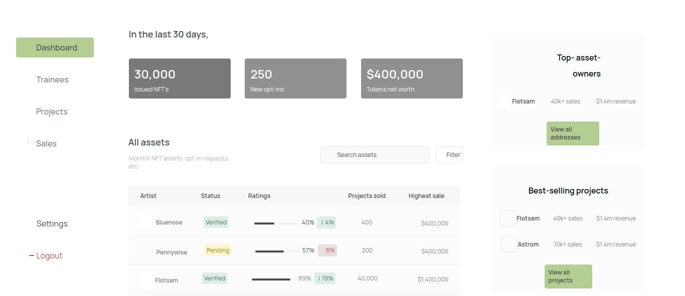

# 10 Academy NFT cert

## Table of Contents

- [About](#about)
- [Getting Started](#getting_started)
- [Usage](#usage)
- [Contributing](../CONTRIBUTING.md)

## About <a name = "about"></a>

 In areas where certificates are issued and verification is necessary - we are solving the challenge of ensuring that certificates are available to all trainees in a secure way, and (if possible) that certificate holders can benefit from smart contract actions now and in the future.  At present, certificates are distributed as simple PDF files, without the ability to verify their authenticity nor can 10 Academy undertake smart actions with the trainees/their contracts.

## Getting Started <a name = "getting_started"></a>

These instructions will get you a copy of the project up and running on your local machine for development and testing purposes. See [deployment](#deployment) for notes on how to deploy the project on a live system.

### Preview
 

### Installing

#### Backend
A step by step series of examples that tell you how to get a development env running in a linux environment.
Things might be slightly different if running things on windows.

Clone repo with submodules -- this will also clone the algorand sandbox together

```bash
git clone someurl -r
cd projdir
```

Create a virtual environment

```bash
python3 -m venv venv
```

Activate virtual env  
```bash
source venv/bin/activate
```

Install requirements
```
pip install -r requirements.txt
```
#### Frontend

Go into frontend directory and read readme.md

## Usage <a name = "usage"></a>

Start algorand sandbox environment
```
cd sandbox
./sandbox up dev 
```

compile.py reads the two functions and writes them to the output files
build.sh builds our smartcontracts